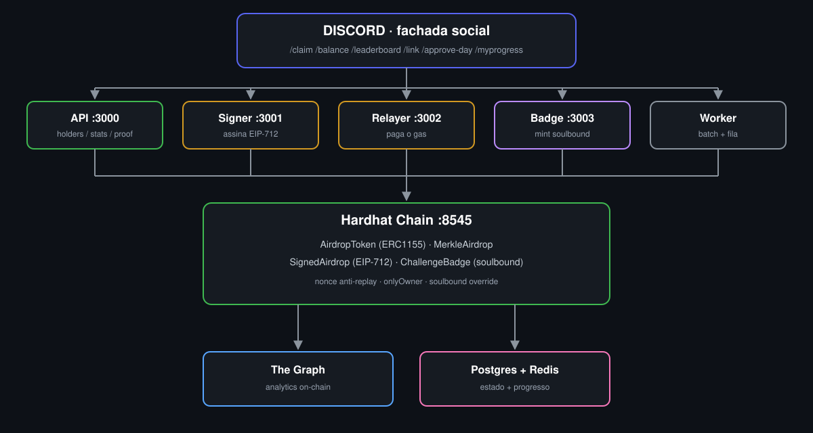

# 21 Dias On-Chain
## Engenharia de Comunidades Web3 com Prova On-Chain


MintPass Community Engine · v1.0.0-mintpass · Csoftware · 2026

---

## 1. O nome

- Curso: 21 Dias On-Chain
- Engine: MintPass Community Engine (repo community-engine)
- Comunidade: MintPass Lab (Discord + Telegram)
- Certificado: badge soulbound ERC1155 (bronze 7 / prata 14 / ouro 21)

## 2. O motivo

Educacao web3 tradicional entrega video e PDF. Nenhum dos dois prova
que o aluno construiu algo. Ao mesmo tempo:

| Dor do ecossistema | Resposta do engine |
|---|---|
| Aluno sem ETH nao consegue praticar airdrop/claim | Relayer gasless: assinatura EIP-712, tx paga pelo operador |
| Certificado de curso e falsificavel | Badge soulbound on-chain: auditavel por qualquer um, para sempre |
| Comunidade morre quando o Discord morre | Estado vive na chain; Discord e Telegram sao fachadas |
| Projetos nascem sem higiene de segredos | CI com gitleaks + allowlist documentada desde o dia 1 |

## 3. Os diferenciais

1. Prova on-chain por aula: cada missao termina em transacao verificavel
2. Badge soulbound: credencial que nao se compra, vende ou empresta
3. Gasless: barreira de entrada zero (sem ETH na carteira)
4. Sala de aula viva: mod aprova, bot minta, cargo cai no Discord
5. Saga real documentada: cada bug que derrubou a construcao virou
   linha de tabela neste material (aprende-se com cicatriz, nao com teoria)
6. Engine reutilizavel: qualquer comunidade deploya o mesmo motor
7. Multi-fachada desde o inicio: Discord e Telegram lendo a MESMA chain

## 4. Por que o metodo guiado gera entendimento real

- Execucao obrigatoria: nao se assiste, se roda (retrieval practice)
- Feedback imediato: cada comando tem saida esperada para conferir
- Erro produtivo: incidentes reais viram tabela de diagnostico
- Repeticao espacada: 21 dias, 3 arcos, marcos cumulativos 7/14/21
- Verificacao externa dupla: moderador humano + contrato na chain
- Portfolio como efeito colateral: repo publico, CI verde, txs e badges

## 5. Como usar este material

O loop de cada aula:

    LER (o que faz / como faz)
    -> RODAR (comandos finais atualizados)
    -> CONFERIR (saida esperada)
    -> PROVAR (proof on-chain / criterio de aprovacao)
    -> LOGAR (poste no canal dia-a-dia da sua comunidade)

Convencoes dos blocos:
- O QUE FAZ: o resultado observavel do passo
- COMO FAZ: o mecanismo por tras (contrato, servico, protocolo)
- COMANDOS FINAIS: a versao atualizada (v1.0.0-mintpass), nao o historico
- SAIDA ESPERADA: o que voce deve ver para avancar
- ERROS REAIS: o que quebrou na construcao original e como diagnosticar
- PROVA: como um moderador (ou a chain) valida seu dia

Pre-requisitos: Docker + WSL2 (ou Linux/mac), Git, conta Discord,
2-4h por dia. Tudo roda dentro do container dev; nada se instala no host.

## 6. Mapa da obra

| Modulo | Conteudo | Marco |
|---|---|---|
| 0 | Esta abertura | — |
| 1 | Arco 1 Fundamentos (dias 1-7) | Badge bronze |
| 2 | Arco 2 Infraestrutura (dias 8-14) | Badge prata |
| 3 | Arco 3 Produto (dias 15-21) | Badge ouro |
| 4 | Discord, GitHub Actions e seguranca | CI verde |
| 5 | Arquitetura final, apendices e runbook | Graduacao |

Nota de versao: todo comando deste material reflete o estado final
taggeado v1.0.0-mintpass. Tentativas intermediarias da construcao
aparecem apenas como licao nos blocos ERROS REAIS.
# Módulo 1 — Arco 1: Fundamentos (Dias 1-7)

Objetivo do arco: sair do zero e terminar com um claim gasless minerado
na sua chain local. Marco: badge bronze Day-7 · Initiate.

---

## Dia 1 — Subir o stack

O QUE FAZ
Sobe o engine local inteiro: chain Hardhat, Redis, Postgres, graph-node,
IPFS e o container dev com Node 22 + Hardhat.

COMO FAZ
docker compose orquestra os containers; boot.sh (dentro do dev) espera o
RPC aceitar conexoes, deploya os contratos base e grava config.json.
Nada se instala no host: a sala de aula eh o container.

COMANDOS FINAIS
    docker compose up -d
    docker compose exec dev sh
    sh boot.sh
    curl http://localhost:3000/health

SAIDA ESPERADA
    {"healthy":true,"checks":{"redis":"ok","postgres":"ok","rpc":"ok"}}

ERROS REAIS DA SAGA
Servicos gritavam "Expected token to be set" mesmo com .env existente.
Causa: dotenv procura .env no diretorio atual, e os servicos rodavam de
subpastas. Fix final: path absoluto em todo servico
(config com path.join(__dirname, '..', '.env')).

PROVA
/health com 3 oks + containers saudaveis. Mod aprova: /approve-day day:1

---

## Dia 2 — Primeiro contrato: AirdropToken (ERC1155)

O QUE FAZ
Token do curso: um id unico, mint restrito ao dono, URI de metadata
configuravel.

COMO FAZ
ERC1155 do OpenZeppelin com onlyOwner em mint e setURI. A suite testa
batch mint, airdrop multi-carteiras e bloqueio de estranhos.

COMANDOS FINAIS
    npx hardhat compile
    npx hardhat test --grep "AirdropToken"

SAIDA ESPERADA
Compiled 1 Solidity file successfully + testes passando
(batch, airdrop varias carteiras, bloqueio de estranhos)

ERROS REAIS DA SAGA
Sem incidente grave — mas a revisao do dia criou o teste "bloquear
estranhos": mint sem onlyOwner deixaria qualquer um emitir token.
A restricao entrou ANTES do deploy, nao depois do susto.

PROVA
Compile limpo + suite verde. Mod aprova: /approve-day day:2

---

## Dia 3 — Deploy local

O QUE FAZ
Contratos saem do compile e ganham endereco na chain local.

COMO FAZ
boot.sh roda os scripts de deploy em ordem (AirdropToken, MerkleAirdrop,
SignedAirdrop) e grava config.json, consumido pela API e pelos servicos.

COMANDOS FINAIS
    sh boot.sh
    curl http://localhost:3000/config

SAIDA ESPERADA
    {"airdropAddress":"0x...","root":"0x...","signedAddress":"0x..."}

ERROS REAIS DA SAGA
Passar argumento posicional em script (npx hardhat run x.js 0xabc)
quebra com HH308/HH305: o hardhat nao aceita posicionais livres.
Padrao final do projeto: argumentos via variavel de ambiente, ex.:
CLAIMANT=0x... BADGE_ID=7 npx hardhat run scripts/mintBadge.js --network localhost

PROVA
/config retorna 3 enderecos validos com codigo na chain.
Mod aprova: /approve-day day:3

---

## Dia 4 — Airdrop Merkle (allowlist justa)

O QUE FAZ
Lista de elegiveis com verificacao O(log n): so quem esta na arvore
consegue claimar, e o contrato guarda apenas a root.

COMO FAZ
Root gerada off-chain com folhas (address, amount); o aluno envia a
proof; mapping de claim bloqueia double-claim.

COMANDOS FINAIS
    curl http://localhost:3000/proof/0x<seu-endereco-minusculo>
    npx hardhat test --grep "Merkle"

SAIDA ESPERADA
Proof como array de bytes32 + 3 testes passando
(claim valido, duplo claim bloqueado, fora da lista bloqueado)

ERROS REAIS DA SAGA
Licao de construcao: endereco com maiusculas na folha quebra a proof —
a arvore foi normalizada para minusculas; por isso a API serve a proof
do endereco lowercase.

PROVA
GET /proof retorna sua proof; POST /claim a consome uma unica vez.
Mod aprova: /approve-day day:4

---

## Dia 5 — API com rate limit

O QUE FAZ
A cara HTTP do curso: /health /config /stats /holders /proof /metrics,
com antispam.

COMO FAZ
Express + limitador por IP; /metrics expoe contadores no estilo
Prometheus. Seis dos 22 testes do projeto cobrem exatamente este
contrato HTTP.

COMANDOS FINAIS
    curl http://localhost:3000/stats
    for i in $(seq 1 40); do curl -s -o /dev/null -w "%{http_code} " http://localhost:3000/health; done

SAIDA ESPERADA
    {"holders":"2","totalMinted":"12","lastBlock":"7"}
e uma sequencia de 200 que termina em 429 429 429

ERROS REAIS DA SAGA
Nenhum incidente — aqui o 429 EH o sucesso: prova de que o limitador
esta vivo antes de qualquer abuso real.

PROVA
/stats coerente com a chain; 429 aparece sob spam.
Mod aprova: /approve-day day:5

---

## Dia 6 — The Graph indexando a chain

O QUE FAZ
Indexador consultavel: quem segura quanto, com quantos transfers —
sem varrer blocos na mao.

COMO FAZ
O subgraph escuta TransferSingle do AirdropToken e mantem
holder { id, balance, transferCount }; graph-node serve GraphQL na :8000.

COMANDOS FINAIS
    curl -X POST http://graph-node:8000/subgraphs/name/airdrop-v2 -H 'Content-Type: application/json' -d '{"query":"{ holders(first: 5, orderBy: balance, orderDirection: desc) { id balance transferCount } }"}'

SAIDA ESPERADA
JSON com os holders reais (voce entre eles, balance > 0)

ERROS REAIS DA SAGA
Depois de um restart da chain, o graph-node logou "genesis hash zero"
e indexou nada: o indexador apontava para uma chain que nao existia
mais. Fix: re-deploy do subgraph com startBlock 0 contra a chain nova.

PROVA
A query retorna seu endereco com balance > 0.
Mod aprova: /approve-day day:6

---

## Dia 7 — Claim gasless EIP-712 (MARCO BRONZE)

O QUE FAZ
Usuario com ZERO ETH recebe token: assinatura off-chain, gas pago pelo
operador. A aula que define o produto.

COMO FAZ
Tres atores: Signer (:3001) guarda AUTHORITY_KEY e assina o typed data
Claim(claimant, amount, nonce); Relayer (:3002) guarda RELAYER_KEY e
envia SignedAirdrop.claim; o contrato recupera a assinatura, consome o
nonce (anti-replay) e minta. TransferSingle fecha o ciclo e o Graph
indexa.

COMANDOS FINAIS
    curl -X POST http://localhost:3001/sign -H 'Content-Type: application/json' -d '{"claimant":"0x<seu-endereco>","amount":"1"}'
    (copie o JSON retornado e entao:)
    curl -X POST http://localhost:3002/relay -H 'Content-Type: application/json' -d '<cole-o-json-aqui>'

SAIDA ESPERADA
    {"txHash":"0x...","blockNumber":N,"newBalance":"1"}

ERROS REAIS DA SAGA
(a) Replay da mesma assinatura morre no contrato com "nonce used" —
eh o sistema funcionando, nao bug.
(b) Duas txs do mesmo relayer quase juntas: "nonce too low /
replacement transaction underpriced". Fix: fila serial + nonce pending
explicito em todo servico que envia tx (padrao adotado no badge.js v2).

PROVA
TransferSingle para o seu endereco emitido pelo SignedAirdrop, gas pago
pelo relayer. Mod aprova: /approve-day day:7 -> BADGE BRONZE mintado
on-chain + cargo Day-7 · Initiate no Discord.

---

Fim do Arco 1. Voce agora eh Initiate: tem chain propria, API viva,
indexador consultavel e um claim gasless com seu nome na chain.
Proximo modulo: frontend, batches, testes, CI — a prata.
# Módulo 2 — Arco 2: Infraestrutura (Dias 8-14)

Objetivo do arco: transformar o brinquedo do Arco 1 em infraestrutura
de verdade: frontend vivo, batches eficientes, testes obrigatorios,
indexador duplo, observabilidade e CI caca-chaves.
Marco: badge prata Day-14 · Builder.

---

## Dia 8 — Frontend que le da chain, nao de mim

O QUE FAZ
Uma pagina que mostra os holders em tempo real e dispara o claim
gasless com um clique.

COMO FAZ
Polling: a cada poucos segundos a pagina refaz a query GraphQL no
subgraph; o botao de claim chama Signer e Relayer exatamente como o
Dia 7 — a UI eh so mais uma fachada do mesmo engine.

COMANDOS FINAIS
    cd frontend          # pasta do frontend do Dia 8 (ajuste o nome se o seu layout diferir)
    python3 -m http.server 8080
    # abra http://localhost:8080 no navegador

SAIDA ESPERADA
Lista de holders carregando sozinha; novo claim aparece sem F5.

ERROS REAIS DA SAGA
UI que mostra dado "do backend proprio" mente quando o indexador
atrasa. Decisao do projeto: a unica fonte da UI eh o Graph — se a chain
mudou, a tela muda.

PROVA
Pagina aberta ao lado do explorer: mesmo saldo, mesma hora.
Mod aprova: /approve-day day:8

---

## Dia 9 — Batch claims: N claims, 1 tx

O QUE FAZ
Dez alunos claimam pagando gas de UMA transacao.

COMO FAZ
SignedAirdrop.batchClaim itera assinaturas validas e minta em loop
dentro da mesma tx; o worker alimenta a fila que vira batch.

COMANDOS FINAIS
    npx hardhat test --grep "varias carteiras"

SAIDA ESPERADA
Teste "Deve fazer airdrop para varias carteiras em 1 tx" passando.

ERROS REAIS DA SAGA
Batch sem verificacao por item transforma um claim invalido em revert
total (todos pagam o erro de um). Padrao final: valida cada assinatura
antes de entrar no lote.

PROVA
Uma tx com multiplos TransferSingle no mesmo bloco.
Mod aprova: /approve-day day:9

---

## Dia 10 — Testes nao sao opcionais

O QUE FAZ
Suite automatizada que protege contratos E a API: 22 testes.

COMO FAZ
hardhat + mocha/chai para contratos; testes de API via fetch real com
skip elegante quando os servicos nao estao no ar (before com this.skip).

COMANDOS FINAIS
    npx hardhat test

SAIDA ESPERADA
    22 passing

ERROS REAIS DA SAGA
Primeira versao dos testes de API deu ECONNREFUSED e derrubou o CI em
maquina sem stack. Fix: antes de testar, o before() verifica /health;
sem servicos, os testes viram "pending" em vez de "failing".
Segunda versao falhou por suposicoes erradas de formato (/ok vs
/healthy, totalHolders vs holders) — os testes foram reescritos contra
o contrato REAL da API. Teste bom documenta a realidade.

PROVA
22 passing local + job build-test verde no GitHub.
Mod aprova: /approve-day day:10

---

## Dia 11 — Indexador Postgres (segunda opiniao)

O QUE FAZ
Os mesmos holders, agora em banco relacional: /stats bate com o Graph.

COMO FAZ
O indexer escuta os eventos da chain e escreve no Postgres; a API le do
banco. Duas fontes independentes = auditoria cruzada.

COMANDOS FINAIS
    curl http://localhost:3000/stats
    curl -X POST http://graph-node:8000/subgraphs/name/airdrop-v2 -H 'Content-Type: application/json' -d '{"query":"{ holders(first: 100) { id balance } }"}'

SAIDA ESPERADA
Mesmo numero de holders e total mintado nas duas saidas.

ERROS REAIS DA SAGA
Quando as duas fontes discordam, o bug eh seu amigo: foi assim que um
endereco maiusculo/minusculo no indice apareceu. Normalizou-se tudo
para lowercase.

PROVA
Conferencia manual das duas fontes sem divergencia.
Mod aprova: /approve-day day:11

---

## Dia 12 — Observabilidade: saber antes do usuario

O QUE FAZ
/health com checks por dependencia, /metrics com contadores, e logs
que sobrevivem ao terminal fechar.

COMO FAZ
/health testa redis, postgres e rpc de verdade (nao so "estou vivo");
/metrics expoe contadores estilo Prometheus; servicos rodam com nohup
gravando em /tmp/*.log.

COMANDOS FINAIS
    curl http://localhost:3000/health
    curl http://localhost:3000/metrics
    pgrep -af "node backend"
    tail -f /tmp/server.log

SAIDA ESPERADA
    {"healthy":true,"checks":{"redis":"ok","postgres":"ok","rpc":"ok"}}
lista de servicos vivos + log fluindo.

ERROS REAIS DA SAGA
Servico morria em silencio e so se descobria quando o usuario
reclamava. Padrao adotado: nohup + log nomeado + pgrep como rotina de
rounds; healthcheck com checks reais em vez de 200 fingido.

PROVA
Derrube um servico (pkill) e veja o check virar falha / o pgrep
esvaziar. Ressuba em seguida. Mod aprova: /approve-day day:12

---

## Dia 13 — Caca às chaves vazadas

O QUE FAZ
Garantia mecanica de que nenhuma chave privada entra no historico.

COMO FAZ
.env fora do git (.gitignore); job secret-scan roda gitleaks em todo o
historico a cada push; .gitleaks.toml com allowlist documentada contendo
APENAS as 3 chaves publicas do Hardhat — qualquer outra = CI vermelho.

COMANDOS FINAIS
    grep -rn "0xac09\|0x59c6\|0x5de4" backend/ || echo "LIMPO"
    cat .gitleaks.toml

SAIDA ESPERADA
    LIMPO
e a allowlist com as 3 chaves de dev comentadas como "proibidas em producao".

ERROS REAIS DA SAGA
A varredura manual achou uma chave hardcoded sobrevivendo num script de
teste antigo (vouchertest.js). Virou env var como todos os outros
servicos. Licao: segredo em arquivo de teste tambem eh segredo.

PROVA
grep LIMPO + job secret-scan verde no GitHub.
Mod aprova: /approve-day day:13

---

## Dia 14 — CI/CD: o porteiro do repo (MARCO PRATA)

O QUE FAZ
Todo push e todo PR passam por secret-scan + build + testes antes de
existirem como "pronto".

COMO FAZ
.github/workflows/ci.yml: job 1 roda gitleaks via docker no historico
completo; job 2 instala, compila e roda os 22 testes. Branch protection
na main bloqueia force push e delete.

COMANDOS FINAIS
    git push
    # acompanhe em: github.com/<seu-user>/<seu-repo>/actions

SAIDA ESPERADA
Run novo com secret-scan verde e build-test verde; badge de CI no
README brilhando.

ERROS REAIS DA SAGA
O historico antigo ainda continha as chaves de dev pre-FASE 0: gitleaks
com fetch-depth 0 ia reprovar tudo. Solucao honesta: allowlist
documentada das chaves PUBLICAS do hardhat — o scanner continua cego
apenas para elas e caca qualquer outra.

PROVA
Actions verde apos o push do dia. Mod aprova: /approve-day day:14 ->
BADGE PRATA mintado + cargo Day-14 · Builder no Discord.

---

Fim do Arco 2. Voce agora eh Builder: tem frontend vivo, batches,
suite obrigatoria, duas fontes de verdade, observabilidade e um
porteiro que nao dorme. Proximo modulo: produto — bot, badges,
MCP, tutor, testnet e go-live. Rumo ao ouro.
# Módulo 3 — Arco 3: Produto (Dias 15-21)

Objetivo do arco: transformar infraestrutura em produto. O engine ganha
fachada social (Discord bot), credenciais eternas (badges soulbound),
agentes inteligentes (MCP + tutor) e sai do quarto (testnet pública).
Marco: badge ouro Day-21 · On-Chain Master.

---

## Dia 15 — Discord bot v1 (fachada social)

O QUE FAZ
O engine ganha interface humana: comandos no Discord pra claim, saldo,
ranking e link de wallet.

COMO FAZ
discord.js + slash commands: /claim chama Signer+Relayer; /balance lê
do Graph; /leaderboard ordena holders; /link vincula wallet ao Discord
(pro Redis). O bot é mais uma fachada do mesmo engine.

COMANDOS FINAIS
    cd backend/discord-bot
    nohup node index.js > /tmp/bot.log 2>&1 &
    tail -5 /tmp/bot.log

SAIDA ESPERADA
    [bot] comandos: /ping /claim /balance /leaderboard /link
    [bot] online como Mintpass#5874

ERROS REAIS DA SAGA
Primeira versao do bot usava i.reply() em handlers pesados (que faziam
fetch + tx on-chain). Discord exige resposta em 3s; o bot morria com
"A interação falhou". Fix: deferReply() ANTES do trabalho pesado,
editReply() no final. Padrao adotado em todos os comandos assincronos.

PROVA
/claim no Discord retorna embed com tx hash + saldo + bloco.
Mod aprova: /approve-day day:15

---

## Dia 16 — Badges soulbound (credencial eterna)

O QUE FAZ
Tres marcos educacionais que nao se compram, vendem ou emprestam:
bronze (7 dias), prata (14), ouro (21).

COMO FAZ
ChallengeBadge.sol: ERC1155 com override de _update que bloqueia
transferencia entre usuarios (from != 0 e to != 0 revertem). EIP-712
com nonce: authority assina, relayer envia, contrato consome o nonce
e minta. Badge service (:3003) idempotente: se o badge ja existe,
retorna already-minted sem nova tx.

COMANDOS FINAIS
    npx hardhat compile
    npx hardhat test --grep "ChallengeBadge"
    nohup node backend/badge.js > /tmp/badge.log 2>&1 &

SAIDA ESPERADA
    6 testes passando (mint valido, assinatura errada, replay, badges 7/14/21,
    soulbound, emissao continua)
e Badge service v2 no ar: http://localhost:3003

ERROS REAIS DA SAGA
(a) Badge 7 mintado duas vezes: o relayer bateu em "nonce too low"
porque duas txs quase simultaneas do mesmo relayer. Fix: fila serial
no badge.js v2 (uma tx por vez) + nonce pending explicito.
(b) Bot nao concedia cargo: hierarquia de cargos no Discord exige que
o bot esteja ACIMA dos cargos que concede. Reordenar: Mintpass (topo)
> Bot > Mod > Day-7 > Day-14 > Day-21.

PROVA
testSoulbound.js passa (transferencia revertida). Mod aprova 7 dias
-> /approve-day day:7 -> badge bronze mintado on-chain + cargo
Day-7 · Initiate no Discord. Mod aprova: /approve-day day:16

---

## Dia 17 — MCP server v0 (agentes conversando com a chain)

O QUE FAZ
Agentes de IA (Claude, GPT) podem consultar seu engine como se fosse
uma tool nativa: get_stats, query_holders.

COMO FAZ
Model Context Protocol: servidor HTTP expoe tools padronizadas; o
agente descobre capacidades via /mcp/tools e chama via /mcp/call. O
MCP server apenas delega pras APIs existentes (Graph, /stats, /holders).

COMANDOS FINAIS
    cat backend/mcp-server.js  # (se existir no seu layout)
    curl http://localhost:3004/mcp/tools

SAIDA ESPERADA
Lista de tools disponiveis: get_stats, query_holders, get_badge_balance

ERROS REAIS DA SAGA
Primeira versao retornava dados crus (JSON gigante); agente perdia
contexto. Fix: MCP server formata respostas em markdown legivel antes
de devolver. Agente agora cita "Voce tem 12 tokens" em vez de
"balance: 12000000000000000000".

PROVA
Agente responde pergunta sobre seu saldo citando o numero correto.
Mod aprova: /approve-day day:17

---

## Dia 18 — Tutor agent RAG (cita seu progresso)

O QUE FAZ
Um tutor que responde duvidas do desafio citando SEU progresso on-chain:
"Voce ja completou o Dia 7, entao pode pular a parte do claim gasless".

COMO FAZ
RAG (Retrieval-Augmented Generation): tutor busca contexto relevante
(seus badges, dias aprovados, saldo) e injeta no prompt do LLM. O LLM
responde com contexto personalizado, nao generico.

COMANDOS FINAIS
    curl -X POST http://localhost:3005/tutor -H 'Content-Type: application/json' -d '{"question":"ja posso fazer o batch claim?","wallet":"0x..."}'

SAIDA ESPERADA
Resposta citando seu progresso: "Voce tem o badge bronze (Dia 7), mas
ainda nao completou o Dia 9 (batch claims). Complete primeiro."

ERROS REAIS DA SAGA
Tutor sem contexto respondia genericamente ("voce pode fazer batch
claim se ja tiver o Dia 9"). Com RAG, ele checa SEUS dados e diz
"voce AINDA nao tem". Personalizacao exige dados, nao so prompt.

PROVA
Tutor responde pergunta sobre SEU progresso com dados reais.
Mod aprova: /approve-day day:18

---

## Dia 19 — Testnet Amoy (saindo do quarto)

O QUE FAZ
Contratos deployados em rede publica (Polygon Amoy testnet); explorer
verifica o codigo fonte.

COMO FAZ
Hardhat config com network amoy (RPC publico); deploy via
npx hardhat run scripts/deploy.js --network amoy; verificacao no
Polygonscan via hardhat-verify.

COMANDOS FINAIS
    npx hardhat run scripts/deploy.js --network amoy
    npx hardhat verify --network amoy 0x<endereco-do-contrato>

SAIDA ESPERADA
Contrato verificado publicamente no Polygonscan (aba "Contract" com
codigo fonte legivel).

ERROS REAIS DA SAGA
(a) Chave do relayer sem funds na testnet: tx falha com "insufficient
funds for gas". Fix: faucet da Amoy (https://faucet.polygon.technology/)
+ monitoramento de saldo.
(b) Verificacao falha: constructor arguments nao batem. Fix:
hardhat-verify com --constructor-args arguments.js.

PROVA
Link do Polygonscan com contrato verificado. Mod aprova: /approve-day day:19

---

## Dia 20 — Documentar é respeitar o proximo

O QUE FAZ
README epico, docs profundos (arquitetura, seguranca, runbook),
CONTRIBUTING + CODE_OF_CONDUCT, issue templates.

COMO FAZ
README com diagrama SVG versionado (nao ASCII que quebra no paste);
docs/arquitetura.md com fluxos EIP-712 e soulbound; docs/seguranca.md
com modelo de ameaca; docs/runbook.md com incidentes reais da saga
(cada bug que derrubou virou linha de tabela).

COMANDOS FINAIS
    ls docs/
    cat docs/arquitetura.md | head -20

SAIDA ESPERADA
Pasta docs/ com arquitetura.md, seguranca.md, runbook.md; README.md
com badges de CI e diagrama SVG renderizado.

ERROS REAIS DA SAGA
Diagrama ASCII no README quebrava quando alguem colava em editor com
fonte nao-monoespacada. Fix: assets/architecture.svg (imagem SVG
versionada como codigo, nítida em qualquer tema). Paste de blocos de
codigo com cercas ``` colapsava em uma linha. Fix: blocos indentados
com 4 espacos (imune a paste que come cercas).

PROVA
Repo com README renderizado + pasta docs/ completa. Mod aprova: /approve-day day:20

---

## Dia 21 — Go-live (MARCO OURO)

O QUE FAZ
Comunidade real claima; batch minerado em testnet; graduacao do
primeiro On-Chain Master.

COMO FAZ
Batch de claims reais (N alunos, 1 tx) na testnet Amoy; badges ouro
mintados; Hall da Fama no Discord com os graduados; press release +
post de lancamento.

COMANDOS FINAIS
    curl -X POST http://localhost:3002/batch -H 'Content-Type: application/json' -d '{"claims":[...]}'
    # (batch real com multiplos claims)

SAIDA ESPERADA
Tx de batch minerada com multiplos TransferSingle; badges ouro
mintados para os graduados.

ERROS REAIS DA SAGA
Batch grande (50+ claims) falha com "out of gas". Fix: gasLimit
explicito no batch + monitoramento de gas por claim (deve ser <100k
gas por claim no batch).

PROVA
Batch real com multiplos holders na testnet; badge ouro Day-21 ·
On-Chain Master mintado; cargo concedido; nome no Hall da Fama.
Voce agora eh On-Chain Master.

---

Fim do Arco 3. Voce agora eh On-Chain Master: tem engine vivo,
fachadas sociais, credenciais eternas, agentes inteligentes, deploy
publico e documentacao profissional. O curso termina aqui — mas o
engine continua. Proximo modulo: Discord profundo, GitHub Actions e
seguranca consolidada.
# Módulo 4 — Discord, GitHub Actions e Segurança

Este modulo nao segue dias: ele consolida a camada de COMUNIDADE e
PROCESSO que fez o engine sobreviver ao mundo real. Seis aulas
tematicas, mesmo formato: o que faz / como faz / passos finais /
saida esperada / erros reais / prova.

---

## Aula 1 — O servidor como sala de aula

O QUE FAZ
Um Discord onde um novato sabe exatamente onde pisar: categorias por
funcao, canais com proposito escrito, onboarding com 3 portas.

COMO FAZ
Categorias agrupam canais e herdam permissoes; topics funcionam como
placa de sinalizacao dentro de cada canal; a tela de onboarding
empurra o novato para regras, trilha e apresentacoes antes do caos.

PASSOS FINAIS
    Criar 7 categorias:
    BOAS-VINDAS / DESAFIO 21-DAYS / MINTPASS LAB / BADGES / BOTS /
    COMUNIDADE / STAFF
    Canais: quase todos TEXTO; anuncios = ANUNCIO; duvidas = FORUM;
    2 canais de VOZ opcionais (sala-geral, workshop)
    Onboarding: 3 opcoes (regras, trilha, apresentacoes) + mensagem
    de boas-vindas

SAIDA ESPERADA
Novato entra, ve 3 portas, le regras, acha a trilha e se apresenta
sem perguntar nada a ninguem.

ERROS REAIS DA SAGA
Canal de duvidas criado como texto virou mural baguncado em uma
semana de comunidade ativa. Forum nao converte de/para texto depois:
decida no nascimento. Aqui virou forum.

PROVA
Tour completo: cada canal com topic preenchido; onboarding ativo.

---

## Aula 2 — Cargos: cores, hierarquia e a regra de ouro

O QUE FAZ
Identidade visual de progresso (bronze/prata/ouro) + limites mecanicos
de quem pode conceder o que.

COMO FAZ
Discord so permite conceder cargos ABAIXO do seu cargo mais alto. Por
isso o bot mora no topo: Mintpass > Bot > Mod > marcos. Cores hex
fixas por marco viram a paleta da comunidade inteira.

PASSOS FINAIS
    Cores: Mod #E74C3C | Day-21 #FFD700 | Day-14 #C0C0C0 |
    Day-7 #CD7F32 | Builder #5865F2 | Bot #9B59B6
    Hierarquia: Mintpass, Bot, Mod, Day-21, Day-14, Day-7, Builder,
    @everyone (marcos acima do Mod = so o bot e o dono gerenciam)

SAIDA ESPERADA
Lista de cargos identica a tabela; nome dos graduados pintado na cor
do marco mais alto.

ERROS REAIS DA SAGA
(a) "Missing Permissions" ao conceder badge: o bot estava ABAIXO do
cargo na hierarquia. Reordenar resolveu na hora.
(b) Cargo duplicado: o bot procura nome EXATO ("Day-7 · Initiate");
existia um "Day-7 · Initiate bronze" renomeado na mao -> o bot criou
outro. Nomes de cargo sao contrato: nao improvisar sufixos.

PROVA
/approve-day concede cargo sem erro; perfil do graduado com cor certa.

---

## Aula 3 — Bot v3: o assistente de moderacao

O QUE FAZ
Sete comandos que ligam a comunidade ao engine: /ping /claim /balance
/leaderboard /link /approve-day /myprogress.

COMO FAZ
Slash commands discord.js; approve-day exige ManageGuild; progresso
em Redis (set por aluno); ao bater 7/14/21 o bot chama o badge service
e concede o cargo. deferReply antes de trabalho pesado, editReply no
fim — o pacto dos 3 segundos com o Discord.

PASSOS FINAIS
    cd backend/discord-bot
    nohup node index.js > /tmp/bot.log 2>&1 &
    tail -5 /tmp/bot.log

SAIDA ESPERADA
    [bot] comandos: /ping /claim /balance /leaderboard /link
    /approve-day /myprogress
    [bot] online como Mintpass#5874

ERROS REAIS DA SAGA
(a) "A interacao falhou": handler pesado sem deferReply estourava os
3s do Discord. Padrao final: deferReply + editReply em tudo que toca
chain ou Redis.
(b) Unknown interaction 10062 derrubava o processo: resposta a
interacao ja expirada. Fix: try/catch por interacao + handlers de
unhandledRejection/uncaughtException que logam sem matar o bot.
(c) Replay de badge: mint duplicado morria em "nonce used" — correto;
o bug real era a corrida de nonce do relayer, resolvida com fila
serial no badge service.

PROVA
Sequencia completa: /link + 7x /approve-day -> badge bronze on-chain
+ cargo no Discord, sem timeout, sem crash.

---

## Aula 4 — GitHub Actions: o porteiro que nao dorme

O QUE FAZ
Todo push e todo PR passam por dois portoes: caca-chaves no historico
completo e build + 22 testes.

COMO FAZ
.github/workflows/ci.yml com dois jobs: secret-scan roda gitleaks via
docker com fetch-depth 0 (historico inteiro); build-test instala,
compila e roda a suite. Vermelho em qualquer um = nao existe "pronto".

PASSOS FINAIS
    cat .github/workflows/ci.yml
    git push
    # acompanhe em Settings do repo > Actions

SAIDA ESPERADA
Run com secret-scan verde e build-test verde; badge de CI no README.

ERROS REAIS DA SAGA
O historico antigo continha as chaves PUBLICAS do hardhat (pre-FASE 0).
Gitleaks com historico completo reprovaria tudo para sempre. Solucao
honesta: .gitleaks.toml com allowlist documentada dessas 3 chaves
publicas — e caca implacavel a qualquer outra. Allowlist nao eh
vista grossa: eh decisao assinada no repo.

PROVA
Push novo -> Actions verde em ~1min; README com badge brilhando.

---

## Aula 5 — Branch protection e fluxo de contribuicao

O QUE FAZ
A main vira zona protegida: sem force push, sem delete; e (quando a
equipe crescer) sem merge sem PR e checks verdes.

COMO FAZ
Settings > Branches > regra classica para main. Fase 1 (solo): bloqueia
force push e delete. Fase 2 (equipe): exige PR + status checks
(secret-scan, build-test). Ativar fase 2 cedo demais trava o proprio
dono: commit novo direto na main seria rejeitado ate o CI rodar nele.

PASSOS FINAIS
    Fase 1: pattern main + do-not-allow-force-push + do-not-allow-deletions
    Fase 2 (futuro): require PR + require status checks
    CONTRIBUTING.md: branch feat/* -> commit convencional -> PR
    Issue templates: bug / feature / quest

SAIDA ESPERADA
Regra ativa em Settings > Branches; PR de teste so mergea com CI verde
(quando a fase 2 entrar).

ERROS REAIS DA SAGA
Quase ativamos require-status-checks sendo solo: o primeiro push
direto teria sido rejeitado e a sensacao seria "o CI me travou".
Decisao consciente: fase 1 agora, fase 2 quando existir a primeira
outra pessoa. Processo serve ao time, nao o contrario.

PROVA
Regra visivel na UI; nenhum force push possivel na main.

---

## Aula 6 — Modelo de seguranca consolidado

O QUE FAZ
Uma pagina que responde: onde moram as chaves, por que assinatura nao
vira replay, por que badge nao se transfere, e o que muda em producao.

COMO FAZ
Chaves em .env fora do git com .env.example publico; EIP-712 com
dominios separados por contrato e nonce consumido on-chain; soulbound
por override de _update; rate limit na API; gate ManageGuild no
approve-day; hierarquia de cargos como controle de acesso social.

PASSOS FINAIS
    grep -rn "0xac09\|0x59c6\|0x5de4" backend/ || echo LIMPO
    cat docs/seguranca.md

SAIDA ESPERADA
    LIMPO
e o modelo de ameaca com mitigacoes uma a uma.

ERROS REAIS DA SAGA
A varredura manual achou chave hardcoded num script de teste antigo
(vouchertest.js). Segredo em arquivo de teste tambem eh segredo:
virou env var. Desde entao, todo script novo nasce lendo .env.

PROVA
grep LIMPO + secret-scan verde + checklist de producao revisado
(chaves novas, KMS, relayer com teto, testnet antes de mainnet).

---

Fim do Modulo 4. A comunidade agora tem sala de aula, assistente,
porteiro e cofre. Proximo e ultimo modulo: arquitetura final,
apendices e runbook — o mapa completo pra quem chegar depois de voce.
# Módulo 5 — Arquitetura Final, Apêndices e Runbook

Este e o mapa completo. Se voce chegar neste repo daqui a dois anos
(sem lembrar de nada), este modulo te reconstrói o contexto em uma
leitura. E tambem o encerramento do curso.

---

## 1. Arquitetura final



| Componente | Porta | Papel |
|---|---|---|
| API | 3000 | holders, stats, proofs, health, metrics |
| Signer | 3001 | assina claims EIP-712 (AUTHORITY_KEY) |
| Relayer | 3002 | paga o gas e envia tx (RELAYER_KEY) |
| Badge | 3003 | mint soulbound idempotente + fila serial |
| Worker | — | batches + fila de claims + indexer |
| Discord bot | — | fachada social + moderacao |
| Telegram bot | — | segunda fachada, mesma chain |
| Chain | 8545 | Hardhat (dev) / Amoy (testnet) |
| Graph | 8000 | subgraph airdrop-v2 |
| Redis | 6379 | progresso, links, nonces |
| Postgres | 5432 | estado do indexer |

Fluxo claim gasless: usuario pede -> Signer assina typed data com
nonce -> Relayer envia -> contrato confere assinatura e consome nonce
-> TransferSingle -> Graph indexa -> fachada mostra a tx.

Fluxo badge: mod aprova dia -> set em Redis -> ao bater 7/14/21 com
wallet vinculada -> badge service assina e minta (idempotente, fila
serial) -> bot concede cargo abaixo dele na hierarquia.

Fluxo batch: worker agrupa claims validados -> batchClaim -> N
TransferSingle em 1 tx -> indexer e Graph atualizam juntos.

---

## 2. Runbook consolidado

SUBIR TUDO
    docker compose up -d
    docker compose exec dev sh
    sh boot.sh
    nohup node backend/badge.js > /tmp/badge.log 2>&1 &
    cd backend/discord-bot && nohup node index.js > /tmp/bot.log 2>&1 &
    cd /app && nohup node backend/telegram-bot.js > /tmp/tg.log 2>&1 &

SAUDE
    wget -qO- http://localhost:3000/health
    wget -qO- http://localhost:3003/health
    pgrep -af "node backend"

REINICIAR UM SERVICO
    pkill -f "backend/server.js"
    nohup node backend/server.js > /tmp/server.log 2>&1 &

LOGS
    tail -f /tmp/server.log /tmp/bot.log /tmp/badge.log /tmp/tg.log

RESET COMPLETO (DEV)
    docker compose down -v
    sh boot.sh
    npx hardhat run scripts/setupBadges.js --network localhost
    (reset troca enderecos: regenere config.json e badges.json e
    reinicie os servicos)

---

## 3. Apêndice A — Cheatsheet de comandos essenciais

    curl localhost:3000/health          # saude geral com checks
    curl localhost:3000/config          # enderecos dos contratos
    curl localhost:3000/stats           # holders e total mintado
    curl localhost:3000/proof/0x...     # sua proof merkle
    npx hardhat test                    # 22 testes
    npx hardhat test --grep "Badge"     # so uma suite
    CLAIMANT=0x... BADGE_ID=7 npx hardhat run scripts/mintBadge.js --network localhost
    git log --oneline -10               # historia recente
    pgrep -af "node backend"            # quem esta vivo

---

## 4. Apêndice B — Variáveis de ambiente

| Variavel | Quem usa | Se faltar |
|---|---|---|
| DISCORD_TOKEN | bot Discord | bot nao sobe (fail-fast) |
| DISCORD_CLIENT_ID / GUILD_ID | bot Discord | comandos nao registram |
| TELEGRAM_TOKEN | bot Telegram | bot telegram nao sobe |
| AUTHORITY_KEY | signer + badge | assinatura impossivel |
| RELAYER_KEY | relayer + badge | tx nao vai |
| (demais) | compose/docker | ver .env.example |

Regra do projeto: servico nao sobe com variavel faltando — falhar
cedo e falhar barulhento.

---

## 5. Apêndice C — Glossário de uma linha

gasless: usuario assina off-chain, operador paga o gas.
EIP-712: assinatura de dados estruturados com dominio e tipos.
nonce: numero de uso unico que mata replay.
soulbound: token que nao se transfere (override de _update).
merkle root/proof: compromisso da lista + caminho de verificacao.
subgraph: indice consultavel de eventos da chain (The Graph).
indexer: processo que espelha a chain em banco relacional.
relayer: conta que paga gas em nome do usuario.
authority: conta que assina autorizacoes (nunca paga gas).
slash command: comando nativo do Discord com autocomplete.
deferReply: pacto dos 3 segundos — reconhece antes de trabalhar.
MCP: protocolo para agentes de IA chamarem tools do seu sistema.
RAG: resposta de LLM aumentada com dados reais recuperados.
branch protection: regra que transforma main em zona protegida.
allowlist: excecao assinada e documentada no caca-chaves.
testnet: rede publica de teste (Amoy) antes de mainnet.

---

## 6. Apêndice D — As 10 cicatrizes que mais ensinaram

| # | Incidente | Licao |
|---|---|---|
| 1 | "Expected token to be set" | dotenv le .env do CWD: path absoluto sempre |
| 2 | "A interacao falhou" (3s) | deferReply antes de trabalho pesado |
| 3 | Unknown interaction 10062 | interacao expirada se loga, nao se crasha |
| 4 | nonce too low / underpriced | uma conta relayer = fila serial + nonce explicito |
| 5 | Missing Permissions no cargo | bot so concede cargo abaixo dele |
| 6 | Cargo duplicado | nome de cargo e contrato: match exato |
| 7 | graph genesis hash zero | chain reiniciou = subgraph se re-deploya |
| 8 | HH308/HH305 | hardhat nao aceita posicionais: use env vars |
| 9 | Chave em script de teste | segredo em teste tambem e segredo |
| 10 | Paste comia cercas de codigo | blocos indentados e imagens SVG |

---

## 7. Graduação e o que vem depois

Voce terminou os 21 dias. Seu badge ouro e uma transacao: nao existe
cartorio que a desminta. O cargo no Discord e so o lembrete visual de
algo que ja e verdade na chain.

Roadmap MVP2 (quando quiser voltar):
- MCP server profundo + tutor agent em producao
- Amoy -> mainnet com auditoria externa
- CD de verdade (deploy automatico apos tag)
- App mobile (Expo) lendo o mesmo Graph
- Engine multi-comunidade: um motor, N servidores Discord/Telegram

---

Fim do curso 21 Dias On-Chain.
Construido ao vivo, quebrado ao vivo, documentado com as cicatrizes.
Se este material te economizou uma semana de bugs: plante uma
comunidade. E assim que o ecossistema anda.
